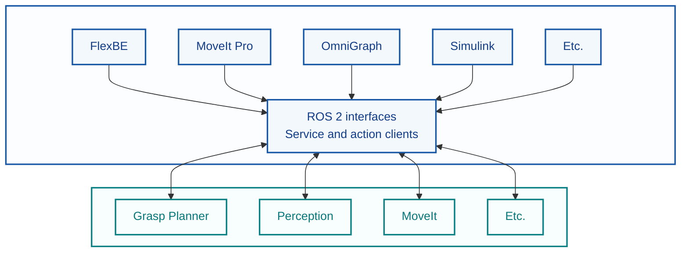

# ROS 2 Methodology

!!! warning "A work in progress"
    The details/layout of this diagram will change as the documentation develops, but this
    space will continue to provide a visual overview of the relationship between
    orchestration clients and modular utility servers.

This site documents a methodology for designing, creating, and integrating modular
ROS 2-wrapped components into larger pipelines, with an initial focus on robot
manipulation using MoveIt. It uses working components to examine the choices behind
their design and to illustrate how responsibilities are divided, how interfaces are
selected, and how each component can remain reusable outside a single pipeline.

The methodology intentionally separates these components from the orchestration
layer that coordinates them. A component exposed through a ROS 2 service or action
can be called by a state machine, behavior tree, graphical workflow tool, custom
script, or any other compatible client. FlexBE is used in this site to demonstrate
one working approach to orchestration, not as a requirement or recommendation.

The goal is not to prescribe one step-by-step implementation or a specific way to
orchestrate a pipeline. Instead, the site captures the reasoning behind concrete
examples so that it can inform decisions when evaluating an existing component or
designing a new one.

## How to use this site

- Start with **[Philosophy](philosophy.md)** for the principles and design goals that guide the
  methodology.
- Use **[ROS 2 Interfaces](ros2-interfaces/index.md)** to compare topics,
  services, and actions and understand the implications of choosing one.
- Use **[ROS Wrapping](ros-wrapping/index.md)** to explore how existing libraries can be exposed as modular
  ROS components.
- Use **[Orchestration Layer](orchestration-layer/index.md)** to examine how higher-level
  workflows can coordinate otherwise independent components. FlexBE is presented
  as one example; other tools or custom code can coordinate the same components.
- Use **[Examples](examples/index.md)** to see existing components, the choices made in their design,
  and how they participate in complete integrations.

!!! warning "A work in progress"
    Some of these sections are still under development, check back for future updates as
    further documentation is added.

!!! note "The central idea"
    Build utilities around explicit ROS 2 service and action interfaces, then let
    the orchestration layer interact with them as a client. This keeps the
    components reusable whether a pipeline is coordinated with FlexBE, another
    orchestration tool, or custom code. The examples in this site illustrate the
    reasoning behind that separation rather than prescribe a single implementation.
