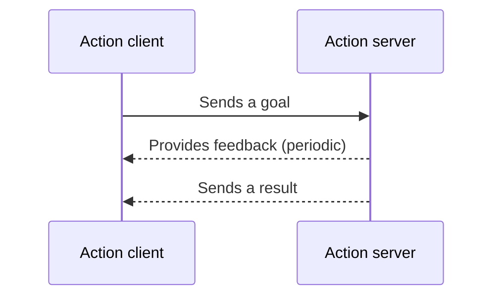

# Actions



<p class="diagram-caption">
  Action client/server sequence reproduced from the
  <a href="https://docs.ros.org/en/jazzy/Concepts/Basic/Interfaces-Topics-Services-Actions.html">ROS 2 interface overview</a>,
  licensed under
  <a href="https://github.com/ros2/ros2_documentation/blob/rolling/LICENSE">CC BY 4.0</a>.
</p>

A ROS 2 action creates a client/server relationship for goal-oriented work that
may take time. The client sends a goal to an action server. The server can accept
or reject it, provide feedback while processing it, return a final result, and
respond to a request to cancel work that is already underway.

In this methodology, the action client typically belongs to the orchestration
layer, while the action server belongs to a separate utility node. This is the same
ownership boundary used for services, with additional support for managing work
between the initial request and the final result.

## Where actions fit

Actions work well when an operation has a clear goal but may run long enough that
the client should not simply wait without information or control. Motion planning,
trajectory execution, navigation, and other operations affected by changing robot
or environment conditions are common examples.

Use a [service](services.md) when the work is short and only needs one request and
one response. Use a [publisher or subscriber](publishers.md) when information
should flow as an ongoing stream rather than as progress toward a requested goal.

## The action interaction

An action adds several stages to the client/server relationship:

1. The client sends a goal request.
2. The server accepts or rejects the goal.
3. The server may send feedback while an accepted goal is running.
4. The client may request cancellation before the work finishes.
5. The server reports a final result, including whether the goal succeeded,
   failed, or was canceled.

These stages make the state of longer-running work visible to the orchestration
layer. They also make cancellation and incomplete work part of the interface
contract instead of behavior that each client must invent separately.

## Minimal action client

The client creates a goal and sends it asynchronously. In this methodology, code
like this would normally be owned by the orchestration layer.

=== "Python (`rclpy`)"

    ```python
    from action_tutorials_interfaces.action import Fibonacci
    from rclpy.action import ActionClient

    self.action_client = ActionClient(self, Fibonacci, "fibonacci")

    goal = Fibonacci.Goal()
    goal.order = 10
    goal_future = self.action_client.send_goal_async(
        goal,
        feedback_callback=self._on_feedback,
    )
    ```

=== "C++ (`rclcpp`)"

    ```cpp
    #include <action_tutorials_interfaces/action/fibonacci.hpp>
    #include <rclcpp_action/rclcpp_action.hpp>

    using Fibonacci = action_tutorials_interfaces::action::Fibonacci;

    action_client_ = rclcpp_action::create_client<Fibonacci>(
      this, "fibonacci");

    Fibonacci::Goal goal;
    goal.order = 10;

    rclcpp_action::Client<Fibonacci>::SendGoalOptions options;
    options.feedback_callback = feedback_callback;
    options.result_callback = result_callback;
    auto goal_future = action_client_->async_send_goal(goal, options);
    ```

These snippets show only goal submission. A complete client must also check that
the server is available, handle goal acceptance or rejection, process feedback and
the final result, apply timeouts, and decide when cancellation is appropriate.

## Minimal action server

The server receives goals and owns their execution. This code belongs to the
utility component rather than the orchestration client.

=== "Python (`rclpy`)"

    ```python
    from action_tutorials_interfaces.action import Fibonacci
    from rclpy.action import ActionServer

    self.action_server = ActionServer(
        self,
        Fibonacci,
        "fibonacci",
        self._execute,
    )

    async def _execute(self, goal_handle):
        feedback = Fibonacci.Feedback()
        result = Fibonacci.Result()

        # Perform work and publish feedback as progress is made.
        goal_handle.publish_feedback(feedback)

        goal_handle.succeed()
        return result
    ```

=== "C++ (`rclcpp`)"

    ```cpp
    #include <action_tutorials_interfaces/action/fibonacci.hpp>
    #include <rclcpp_action/rclcpp_action.hpp>

    using Fibonacci = action_tutorials_interfaces::action::Fibonacci;
    using GoalHandle = rclcpp_action::ServerGoalHandle<Fibonacci>;

    action_server_ = rclcpp_action::create_server<Fibonacci>(
      this,
      "fibonacci",
      handle_goal,
      handle_cancel,
      handle_accepted);

    // The accepted-goal handler starts the work outside the executor callback.
    // Execution publishes feedback and eventually calls succeed, abort, or canceled.
    ```

These snippets show the shape of an action server rather than a complete
implementation. A complete server must define how it validates goals, performs
work without blocking the executor, publishes useful feedback, handles cancellation,
and reports every possible result.

## Questions to answer

- What goal is the client asking the server to accomplish?
- What information does the client need while the goal is running?
- Under what conditions may the server reject a goal?
- When should the client be allowed to cancel, and how should the server stop
  safely?
- What do success, failure, and cancellation mean to the rest of the workflow?
- Can more than one goal run at once, or must new goals wait or replace old ones?
- Is the operation long or controllable enough to justify an action, or would a
  service provide a simpler interface?

## MoveIt `move_group` as an example

MoveIt's `move_group` node brings motion-planning components together and exposes
ROS 2 actions and services for clients to use. Its
[`MoveGroup` action](https://docs.ros.org/en/jazzy/p/moveit_msgs/action/MoveGroup.html)
allows an orchestration client to submit a motion-planning goal without depending
on the planner's internal implementation.

This interaction belongs naturally in an action because planning and execution
may take time and may be affected by the current robot state, planning scene, or
controller. The client needs to know whether its goal was accepted, can receive
state feedback while work is underway, receives a final result describing the
outcome, and can request cancellation if the motion is no longer appropriate.

From the orchestration layer's perspective, the sequence remains focused on the
goal rather than MoveIt's internal steps:

1. Send the requested motion and planning options as an action goal.
2. Confirm that `move_group` accepted the goal.
3. Observe feedback while planning or execution proceeds.
4. Cancel if the workflow or environment makes the goal invalid.
5. Use the final result to decide what the pipeline should do next.

MoveIt also demonstrates that the same client/server pattern can appear at more
than one level. It acts as the server for the orchestration client, then uses topics,
services, and actions internally—including controller actions—to perform the
requested work. Those internal details remain behind the `move_group` interface.

The [MoveIt example](../examples/moveit.md) will provide the appropriate place for
configuration, planning-scene setup, complete goal construction, execution, and
recovery details.

## FlexBE as an example

The [FlexBE Action State](../orchestration-layer/flexbe-action-state.md) will show
how an orchestration state sends a goal, handles feedback and results, maps action
outcomes into workflow transitions, and requests cancellation when needed.

For complete action client and server implementations, see the official ROS 2
tutorials for
[Python](https://docs.ros.org/en/jazzy/Tutorials/Intermediate/Writing-an-Action-Server-Client/Py.html)
and
[C++](https://docs.ros.org/en/jazzy/Tutorials/Intermediate/Writing-an-Action-Server-Client/Cpp.html).
For the larger MoveIt architecture, see the official
[`move_group` documentation](https://moveit.picknik.ai/main/doc/concepts/move_group.html).

!!! note "The central idea"
    The orchestration layer owns the action client, and the utility owns the action
    server. Use an action when the client must manage a goal between request and
    result through acceptance, feedback, cancellation, or another visible outcome.
