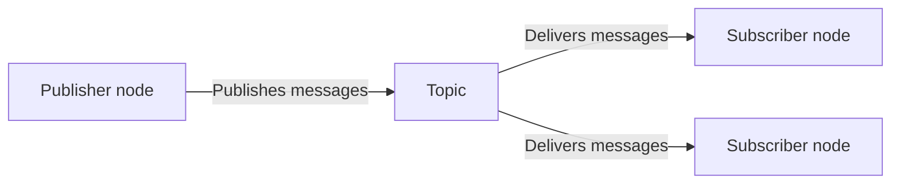

# Publishers



<p class="diagram-caption">
  Topic publisher/subscriber flow reproduced from the
  <a href="https://docs.ros.org/en/jazzy/Concepts/Basic/Interfaces-Topics-Services-Actions.html">ROS 2 interface overview</a>,
  licensed under
  <a href="https://github.com/ros2/ros2_documentation/blob/rolling/LICENSE">CC BY 4.0</a>.
</p>

A publisher sends messages on a named ROS 2 topic at a fixed rate and updates the 
broadcasted information or whenever it is available. It does not wait for a request, 
track which subscribers receive the message, or return a result to a particular 
client. Any number of subscribers can listen to the same topic.

Within the client/server language used by this methodology, a publisher can be
thought of as **server-like** because it provides information for the rest of the
system. It is not a service or action server, it broadcasts openly rather than 
responding to a specific request.

## Where publishers fit

Publishers work well for sensor readings, state updates, status messages, and
events that may be useful to several parts of a system. They are less suitable
when a client makes a request to a specific operation in order to learn whether 
that operation succeeded. Use a [service](services.md) for a short request and 
response, or an [action](actions.md) when the work requires feedback or cancellation.

For a simple message, publishing may happen directly inside the orchestration
layer. In that case, the reusable abstraction is the topic and its message contract
rather than a separate wrapped utility. A dedicated publishing component can still
be valuable when producing the data requires substantial processing, validation,
hardware access, or lifecycle management.

## Minimal setup

=== "Python (`rclpy`)"

    ```python
    from std_msgs.msg import String

    self.publisher = self.create_publisher(String, "status", 10)

    message = String()
    message.data = "ready"
    self.publisher.publish(message)
    ```

=== "C++ (`rclcpp`)"

    ```cpp
    #include <std_msgs/msg/string.hpp>

    publisher_ = this->create_publisher<std_msgs::msg::String>("status", 10);

    std_msgs::msg::String message;
    message.data = "ready";
    publisher_->publish(message);
    ```

These snippets show only the publisher itself. A complete node must also initialize
ROS 2, create or inherit from a node, and keep the publisher alive while messages
are being sent.

## Questions to answer

- What does the topic represent?
- What message type, units, frame, timestamp, and validity rules apply?
- How often will messages be published?

## Further considerations (QoS)

ROS 2 provides additional controls for how topic data is delivered, including
Quality of Service settings. Those controls are important in some systems, but
they are outside the focus of this methodology. The examples in this site will use
the default settings unless an integration has a specific reason to do otherwise.
See the official ROS 2
[Quality of Service documentation](https://docs.ros.org/en/jazzy/Concepts/Intermediate/About-Quality-of-Service-Settings.html)
when delivery reliability, message history, or behavior over unreliable networks
needs more careful control.

## FlexBE as an example

The [FlexBE Publisher State](../orchestration-layer/flexbe-publisher-state.md) will
show how a publisher can live directly inside an orchestration state. This is an
example of the orchestration layer producing a topic message without requiring a
separate utility server.

For complete setup and package instructions, see the official ROS 2 publisher and
subscriber tutorials for
[Python](https://docs.ros.org/en/jazzy/Tutorials/Beginner-Client-Libraries/Writing-A-Simple-Py-Publisher-And-Subscriber.html)
and
[C++](https://docs.ros.org/en/jazzy/Tutorials/Beginner-Client-Libraries/Writing-A-Simple-Cpp-Publisher-And-Subscriber.html).

!!! note "The central idea"
    A publisher provides a stream of messages rather than performing requested
    work. For simple uses, the topic interface itself may provide enough separation
    between the orchestration layer and the source of the information.
