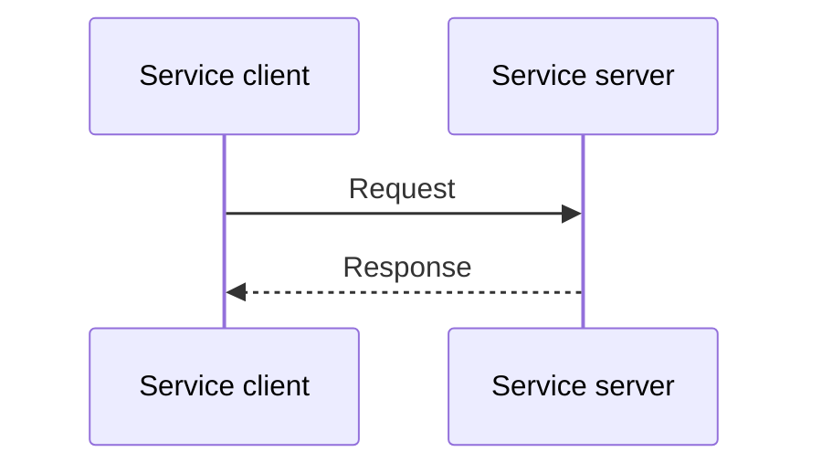

# Services



<p class="diagram-caption">
  Service client/server sequence reproduced from the
  <a href="https://docs.ros.org/en/jazzy/Concepts/Basic/Interfaces-Topics-Services-Actions.html">ROS 2 interface overview</a>,
  licensed under
  <a href="https://github.com/ros2/ros2_documentation/blob/rolling/LICENSE">CC BY 4.0</a>.
</p>

A ROS 2 service creates a direct client/server relationship. The client sends one
request to a named service, and the server returns one response associated with
that request. Unlike a topic broadcast, this interaction gives the client a clear
place to ask for work and receive its result.

In this methodology, the service client typically belongs to the orchestration
layer, while the service server belongs to a separate utility node. The utility
can wrap an existing library behind a ROS 2 interface, allowing the orchestration
layer to use the capability without depending on the library's internal API or
implementation language.

## Where services fit

Services work well for operations that begin with a specific request, finish in a
reasonable and predictable amount of time, and return one response. A client can
make the request asynchronously so that the orchestration layer does not need to
block while the server performs the work.

Use a [publisher or subscriber](publishers.md) when information should flow as an
ongoing stream rather than in response to a request. Use an [action](actions.md)
when an operation may take longer, needs progress feedback, or might need to be 
canceled during execution.

## Wrapping a library as a service

!!! note "An important concept"
    The wrapped library does not need to know anything about the orchestration layer 
    and should also not rely on or make any assumptions about the orchestration layer.

The service server receives ROS 2 request data, converts it into the form expected
by the library, calls the required library functionality, and converts the result
into a ROS 2 response. The service definition becomes the contract between
the client and the utility.

This separation lets the utility's implementation change without changing the
orchestration workflow as long as the service contract remains consistent. It
also allows another orchestration tool or custom script to use the same utility 
by simply creating a client for that service.

## Minimal client request

The client creates and sends the request. In this methodology, code like this would
normally be owned by the orchestration layer.

=== "Python (`rclpy`)"

    ```python
    from example_interfaces.srv import AddTwoInts

    self.client = self.create_client(AddTwoInts, "add_two_ints")

    request = AddTwoInts.Request()
    request.a = 2
    request.b = 3
    future = self.client.call_async(request)
    ```

=== "C++ (`rclcpp`)"

    ```cpp
    #include <example_interfaces/srv/add_two_ints.hpp>

    using AddTwoInts = example_interfaces::srv::AddTwoInts;

    client_ = this->create_client<AddTwoInts>("add_two_ints");

    auto request = std::make_shared<AddTwoInts::Request>();
    request->a = 2;
    request->b = 3;
    auto future = client_->async_send_request(request);
    ```

These snippets show only request creation and submission. A complete client must
also check that the service is available, handle the response when the future
completes, and decide what to do if the request fails or exceeds its timeout.

## Minimal service server

The server receives the request, performs the operation, and fills in the response.
This code belongs to the utility component rather than the orchestration client.

=== "Python (`rclpy`)"

    ```python
    from example_interfaces.srv import AddTwoInts

    self.service = self.create_service(
        AddTwoInts,
        "add_two_ints",
        self._add_two_ints,
    )

    def _add_two_ints(self, request, response):
        response.sum = request.a + request.b
        return response
    ```

=== "C++ (`rclcpp`)"

    ```cpp
    #include <example_interfaces/srv/add_two_ints.hpp>

    using AddTwoInts = example_interfaces::srv::AddTwoInts;

    service_ = this->create_service<AddTwoInts>(
      "add_two_ints",
      [](const std::shared_ptr<AddTwoInts::Request> request,
         std::shared_ptr<AddTwoInts::Response> response) {
        response->sum = request->a + request->b;
      });
    ```

These snippets show only the service callback. A complete server must also
initialize ROS 2, create or inherit from a node, keep the service alive, and handle
invalid requests and library failures in a way the client can understand.

## Questions to answer

- What capability is the service making available?
- What information must the client provide, and what result does it need back?
- What does success or failure mean to the client?
- How long should the operation normally take, and how long should the client wait?
- Can the operation finish without progress feedback or cancellation? If not,
  should it be an action instead?

## A PCL filter service as an example

The
[`voxel_grid_filter_service`](https://github.com/uml-robotics/pcl_ros2/blob/main/src/voxel_grid_filter_service.cpp)
is a compact example of wrapping one piece of library functionality in a ROS 2
service server. The underlying Point Cloud Library (PCL) provides the voxel-grid
filter, while the `pcl_ros2` wrapped node provides the ROS 2 interface used by the rest of
the pipeline.

The service performs one focused sequence:

1. Receive a ROS 2 service request containing a `sensor_msgs/PointCloud2` message
   and the settings needed by the filter.
2. Convert the ROS 2 point-cloud message into a PCL point-cloud object.
3. Apply the PCL voxel-grid filter to downsample the cloud.
4. Convert the filtered PCL object back into a ROS 2 point-cloud message.
5. Return that message in the service response.

This server does not reimplement the voxel-grid algorithm. It creates a stable ROS
2 boundary around existing PCL functionality and handles the conversion between
ROS 2 and PCL data types. The orchestration client only needs to understand the
service request and response; it does not need to include PCL, manage PCL objects,
or know how the filter is implemented.

The example also illustrates why a small wrapper can still be a useful independent
component. Although the underlying operation is simple, placing it behind a
service allows the same filter utility to be requested by FlexBE, another
orchestration tool, or custom code without moving PCL-specific logic into any of
those clients.

Wrapping a small operation this way does add service-call and data-conversion
overhead. In the pipelines described here, that cost has been negligible compared
with the flexibility it provides: filters can be chained, reordered, or inspected
individually by publishing intermediate results. This makes it easier to identify
which operation changed the data or where useful information was lost. The
[Orchestration Layer](../orchestration-layer/index.md#composing-utility-pipelines)
section introduces this intentional trade-off and will explore it in more detail.

For complete package and node setup, see the official ROS 2 service and client
tutorials for
[Python](https://docs.ros.org/en/jazzy/Tutorials/Beginner-Client-Libraries/Writing-A-Simple-Py-Service-And-Client.html)
and
[C++](https://docs.ros.org/en/jazzy/Tutorials/Beginner-Client-Libraries/Writing-A-Simple-Cpp-Service-And-Client.html).

!!! note "The central idea"
    The orchestration layer owns the service client, and the utility owns the
    service server. The server wraps the useful work behind a stable ROS 2 request
    and response, allowing either side to change without tightly coupling the
    orchestration workflow to the underlying library.
