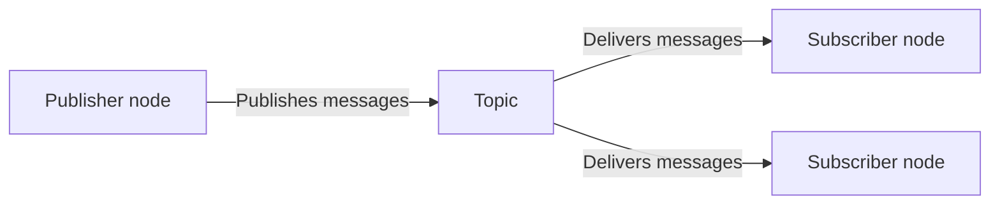

# Subscribers



<p class="diagram-caption">
  Topic publisher/subscriber flow reproduced from the
  <a href="https://docs.ros.org/en/jazzy/Concepts/Basic/Interfaces-Topics-Services-Actions.html">ROS 2 interface overview</a>,
  licensed under
  <a href="https://github.com/ros2/ros2_documentation/blob/rolling/LICENSE">CC BY 4.0</a>.
</p>

A subscriber listens to a named ROS 2 topic and runs a callback when a matching
message arrives. It does not ask the publisher to produce that message and does not
receive a result tied to a particular request.

Within the client/server language used by this methodology, a subscriber can be
thought of as **client-like** because it consumes information provided by another
part of the system. It is not a service or action client, it listens to a
broadcast and is one of many potential subscribers receiving the same message.

## Where subscribers fit

Subscribers work well when the orchestration layer needs to observe sensor data,
state updates, status messages, or events. They are less suitable when the
orchestration layer needs to start a specific operation, associate updates with
that request, or receive a clear result. Use a [service](services.md) for a short
request and response, or an [action](actions.md) for goal-oriented work with
feedback or cancellation.

For simple messages, a subscriber may live directly inside the orchestration layer.
In that case, as with the publisher example, the topic and message contract provide 
the abstraction. More involved validation, data transformation, or long-running 
processing may still belong in an independent component.

## Minimal setup

=== "Python (`rclpy`)"

    ```python
    from std_msgs.msg import String

    self.subscription = self.create_subscription(
        String,
        "status",
        self._on_status,
        10,
    )

    def _on_status(self, message):
        self.get_logger().info(message.data)
    ```

=== "C++ (`rclcpp`)"

    ```cpp
    #include <functional>
    #include <std_msgs/msg/string.hpp>

    subscription_ = this->create_subscription<std_msgs::msg::String>(
      "status",
      10,
      [this](const std_msgs::msg::String & message) {
        RCLCPP_INFO(this->get_logger(), "%s", message.data.c_str());
      });
    ```

These snippets show only the subscription itself. A complete node must also
initialize ROS 2, create or inherit from a node, and keep the subscription alive
while messages are being received.

## Questions to answer

- What information does the workflow need from the topic?
- What should the workflow do when that information arrives, and what should it do
  if no message arrives?
- How recent must the information be to remain useful?
- Can the workflow use the message directly, or does it need validation,
  transformation, or other processing first?
- Is observing the topic enough, or does the workflow need to request work and
  receive a specific result through a service or action?

## Further considerations (QoS)

ROS 2 provides additional controls for how topic data is delivered, including
Quality of Service settings. Those controls are important in some systems, but
they are outside the focus of this methodology. The examples in this site will use
the default settings unless an integration has a specific reason to do otherwise.
See the official ROS 2
[Quality of Service documentation](https://docs.ros.org/en/jazzy/Concepts/Intermediate/About-Quality-of-Service-Settings.html)
when delivery reliability, message history, or behavior over unreliable networks
needs more careful control.

## A subscriber inside a service

The
[`get_point_cloud_service`](https://github.com/uml-robotics/pcl_ros2/blob/main/src/get_point_cloud_service.cpp)
node shows how subscription can also be an internal step within a separate utility.
From the orchestration layer's perspective, this node is a service server: a client
requests a point cloud from a specified topic, in a specified coordinate frame,
with a timeout.

Inside the service implementation, the node waits for one point-cloud message:

```cpp
const bool ok = rclcpp::wait_for_message<sensor_msgs::msg::PointCloud2>(
  cloud, sub, context, timeout);
```

After receiving that message, the node uses TF2 to transform the point cloud into
the requested coordinate frame and returns the transformed data in the service
response. The sequence can be summarized as:

1. Receive a service request.
2. Subscribe long enough to capture one point-cloud message.
3. Transform the point cloud into the requested frame.
4. Return the transformed point cloud as the service result.

In this practical example the service creates a controlled,
on-demand operation with a timeout and a specific result, while hiding the details
of topic subscription and coordinate transformation from the orchestration layer.
The subscriber is still important, but it is an implementation detail of the
utility rather than the interface used by the orchestration client.

!!! tip "Interface and implementation can differ"
    A utility can expose a service or action even when it uses topics internally.
    Choose the public interface based on how clients need to use the capability,
    then use publishers, subscribers, and supporting libraries as needed inside
    the implementation.

## FlexBE as an example

The [FlexBE Subscriber State](../orchestration-layer/flexbe-subscriber-state.md)
will show how a subscription can be contained directly within an orchestration
state and how incoming message data can influence the workflow.

For complete setup and package instructions, see the official ROS 2 publisher and
subscriber tutorials for
[Python](https://docs.ros.org/en/jazzy/Tutorials/Beginner-Client-Libraries/Writing-A-Simple-Py-Publisher-And-Subscriber.html)
and
[C++](https://docs.ros.org/en/jazzy/Tutorials/Beginner-Client-Libraries/Writing-A-Simple-Cpp-Publisher-And-Subscriber.html).

!!! note "The central idea"
    A subscriber observes a stream rather than requesting work. When the
    orchestration layer only needs to receive a simple topic message, placing the
    subscription directly in that layer can be the clearest implementation.
